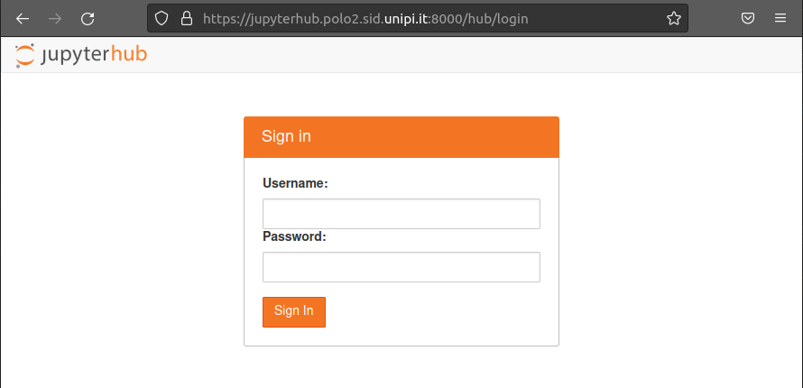
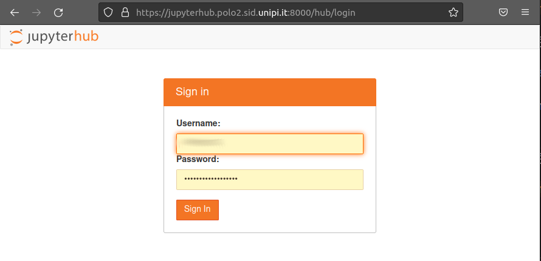
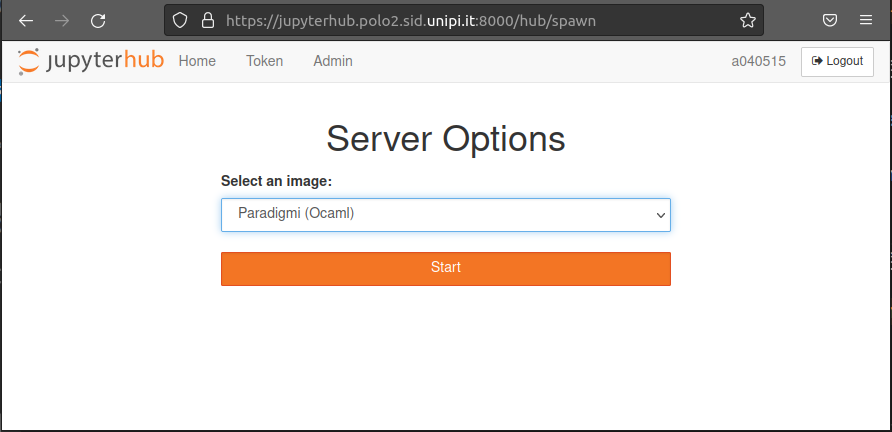
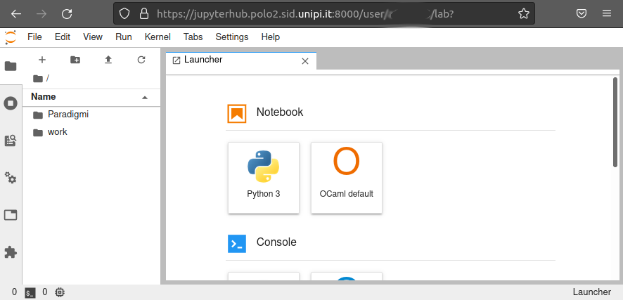
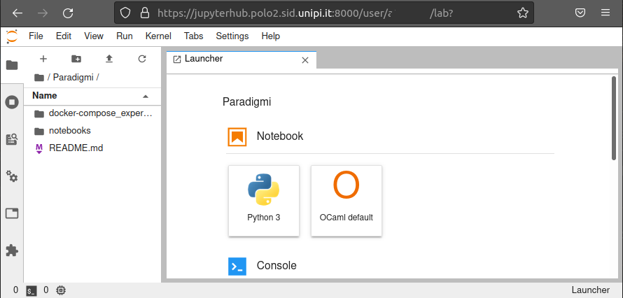
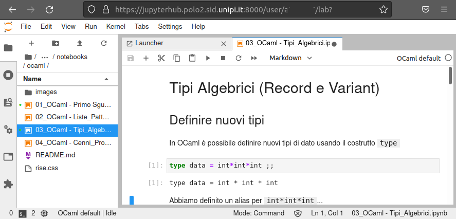
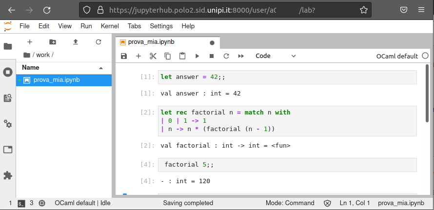
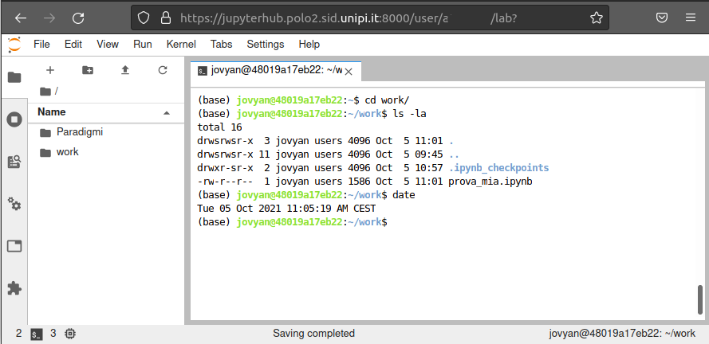
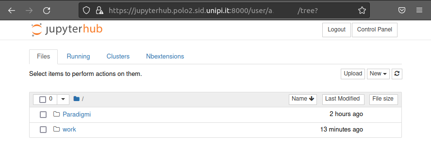

# How to use OCaml on JupyterHub@Unipi
- [How to use OCaml on JupyterHub@Unipi](#how-to-use-ocaml-on-jupyterhubunipi)
      - [Connect to the server](#connect-to-the-server)
      - [Login with you credential](#login-with-you-credential)
      - [Select the `Paradigmi (OCaml)` image](#select-the-paradigmi-ocaml-image)
      - [Notebook Folders and Launcher](#notebook-folders-and-launcher)
      - [Use the Jupyter Notebook interface](#use-the-jupyter-notebook-interface)
      - [Disclaimer](#disclaimer)
#### Connect to the server

Go to <https://jupyterhub.polo2.sid.unipi.it:8000/> or <https://jupyterhubfm.df.unipi.it:8000/>

#### Login with you credential

Use your [credential](https://autenticazione.unipi.it/) (username is the email address part before the `@`)

#### Select the `Paradigmi (OCaml)` image

#### Notebook Folders and Launcher

You can find two folders:

- `Paradigmi` is the folder containing the cloned [Paradigmi repository](https://github.com/Unipisa/Paradigmi) updated every 15 minutes.  
The folder is read-only.

- `work` is your personal working directory. You can write here and play freely. The data is persistent, saved in your personal container and you will find saved data on subsequent logins.

Inside the notebook you can run the proposed launchers, for instance you can run a terminal

#### Use the Jupyter Notebook interface

You can switch to the Jupyter Notebook interface replacing `/lab?` with `/tree?` in the url

#### Disclaimer 

**These resources are shared and their use i **monitored**: be considerate in your use.** :warning: 

